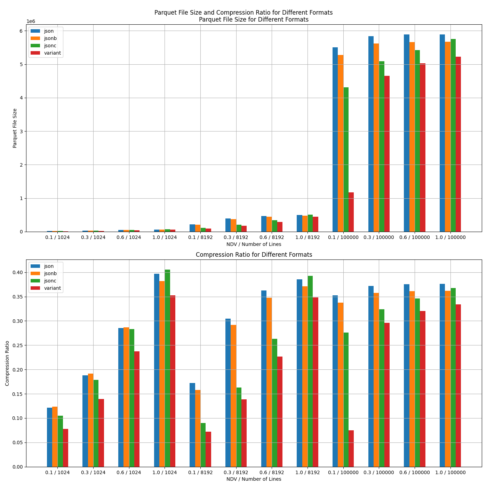

# Benchmark of JSON Formats in Memory and Parquet File

## Purpose

The repo benchmarks the encoding/decoding performance and storage/query efficiency in parquet files of a variety of json encoding formats. It covers:

- JSON, json in plain string
- JSONB
- JSONC, a variant of tape representation
- Variant, dynamically parse json as arrow struct

Six different kinds of metrics for each format are evaluated:

- Encode time, time to read json strings and encode into in-memory representations
- Decode time, time to decode the in-memory representations into json strings
- Flush time, time to flush the in-memory representations into a parquet file
- Load time, time to load jsons from parquet files to in-memory representations
- Parquet file size and compression ratio
- Query time

The JSON payloads are characterized by the following params:

- Data types
- Max nested layer
- NDV, the number of distinct values, which is important for the compression methods in parquet
- Num of lines, num of jsons encoded into a parquet file, say, rows in a row group

## Results in Different Payloads

Payload 1: Events of opentelemetry traces:

Data Types: Float, String, Object

Max Nested Layer: 2

NDV: [0.1, 0.3, 0.6, 1.0]

Num of Lines: [1024, 8192, 100000]

Metric: [Parquet file size and compression ratio]

Example of a line:

```JSON
{
  "name": "jHl2oDDnPc1i2OzlP5Y",
  "timestamp": "2024-07-25T04:33:11.369386Z", # timestamp is distinct for all lines
  "attributes": { "event_attributes": 48.28667666464348 }
}
```

Results:

